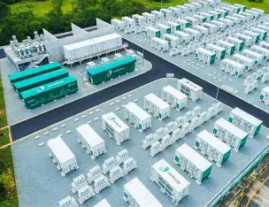
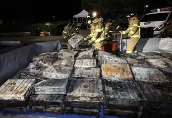

# 에너지 저장장치(ESS) 산업의 성장과 위험 요소

### ESS(Energy Storage System)이란

쉽게 설명하자면 매우 큰 보조 배터리이다. 하지만 규모는 우리가 사용하는 휴대폰의 규모가 아닌 우리가 실생활 또는 산업에서 사용할 수 있는 규모가 큰 보조 배터리인 것이다.

### ESS 산업의 성장
+ 성장 동력
1. 재생에너지(태양광·풍력 등) 확대에 따른 전력 저장 수요 증가
2. 전기차 충전 인프라 및 데이터센터 전력 안정화 수요
3. 전력망 안정성과 피크 수요 대응을 위한 분산형 에너지 시스템 확산
+ 주요지역: 북미, 유럽, 아시아(특히 한·중·일)가 핵심 성장 축

### 차세대 배터리 기술 전망

+ #### 안정성 확보: 과거 화재 사례 이후 열 차단 기술, 분리형 설계, 환기 시스템 등의 강화

+ #### 폐배터리 재활용: ESS용으로 2차 활용하는 REUSE(재활용) 시장도 성장중

##### 배터리 기술의 다변화
|   기술명   |   특징   |   장점   |   과제    | 
|--------|-------|--------|--------|
| 전고체 배터리 | 고체 전해질 사용 | 안전성 향상, 에너지 밀도 증가 | 제조 난이도, 비용 | 
| 리튬-황 배터리 | 황을 음극으로 사용 | 고에너지 밀도, 저비용 | 수명 문제, 안정성 | 
| 나트륨이온 배터리 | 리튬 대체 소재 | 저비용, 자원풍부 | 낮은 에너지 밀도 | 
| 실리콘 음극 배터리 | 실리콘 기반 음극 | 에너지 밀도 향상 | 팽창 문제, 수명 | 
| 플로우 배터리 | 액체 전해질 순환 | 장시간 저장, 대용량 | 부피 큼, 복잡한 시스템 | 

## ESS의 위험요소

#### 리튬이온 배터리(LIB)의 주요 한계

+ __화재 및 폭발 위험__: 액체 전해질의 휘발성과 리튬 금속의 반응성으로 인해 내부 단락 시 열폭주가 발생할 수 있음.

+ __충전 속도 제한__: 고속 충전 시 발열이 심해지며, 안정성과 수명이 저하됨.

+ __원재료의 희소성 및 환경 문제__: 리튬, 코발트, 니켈 등의 희귀 금속은 채굴 비용이 높고 환경에 악영향을 미칠 수 있음.

+ __수명 및 성능 저하__: 반복 충전 시 성능이 점차 저하되며, 긴 사용시간 확보가 어려움.

#### 대표적인 안전사고 사례
+ 2025년 대전 국가정보자원관리원 화재

##### 화재 발생의 핵심 원인
+ __열폭주 현상__: 리튬이온 배터리는 에너지 밀도가 높지만, 내부 온도가 일정 수준을 넘으면 화학 반응이 폭발적으로 증가하며 인접 배터리로 열이 확산.
+ __UPS(분산형 전원) 배터리 노후화__: 해당 배터리는 2013년 납품된 제품으로 권장 사용기간(10년)을 초과한 상태였으며, 전원 차단 작업 중 폭발이 발생.
+ __배터리 교체 작업중 사고__: UPS 점검 및 배터리 교체 과정에서 전원 차단중 폭발이 일어났고, 이로 인해 전산실 내 384개의 배터리팩이 모두 소실.
+ __방폭 설비 및 환기 부족__: 배터리실이 폭발위험구역으로 분류되지 않았고, 방폭 인증이나 환기 설비가 미비해 화재 확산을 막지 못했음.
+ __물리적 설계 문제__: UPS실과 서버실이 수직으로 배치되어 있어 불기이 위아래로 확산되며 전체 시스템이 마비되었음.