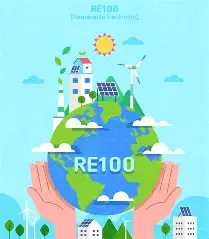

# **RE100_Campaign**

RE100은 'Renewable Energy 100%'의 줄임말로, 
기업이 사용하는 전력의 100%를 재생에너지로 전환하겠다는 의미의 글로벌 캠페인이다.

## RE100의 핵심목표

+ 2050년까지 100% 재생에너지로 전환
+ 일부 기업은 2030~40년까지 조기 달성 목표로 설정
+ 태양광, 풍력, 수력, 지열, 바이오매스 등 청정에너지 자원만 인정

## RE 가입조건
#### 참여대상
+ 연간 100GWh 이상 전력 소비하는 기업이 주 대상
+ 국가별 특수성과 산업 영향력에 따라 예외 조항이 있음

#### 필수조건
1. 100% 재생에너지 사용 목표 공개
2. 연간 진척 상황 보고
3. 검증된 재생에너지 사용증명(EAC, REC 등)