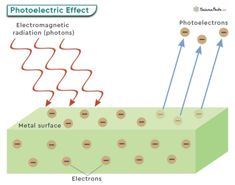
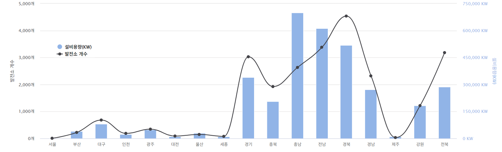

# 태양광 에너지

### 태양광 발전의 원리
 

[왼, 광전효과 / 우, 태양광 발전 원리]

##### 광전효과
+ 광전효과는 금속 물질에 빛을 쪼이면 금속물질이 전자를 내놓는 현상.
+ 금속 내의 전자는 원자행 (+)전하와의 전기력에 의해 속박됨. 여기에 일정 진동수 이상이 빛을 비추었을 댸 광자가 전자와 충동하게 된다.

###### 태양광 발전
+ 햇빛(태양의 전자기파)으로 부터 광전효과가 일어나면서 정공과 전자가 발생하고 +전극과 -전극이 형성됨.
+ 형성된 두 전극이 외부회로와 접속되어 있다면 전류가 흐르게 되어 태양의 빛 에너지로부터 전기 에너지로 변환시키는 것.

### 태양광 발전소 설치 현황

### 지역별 설비용량 및 발전소 개수

| 지역   | 설비용량 (kW) | 발전소 개수 |
|--------|----------------|--------------|
| 서울   | 282            | 8            |
| 부산   | 40,877         | 225          |
| 대구   | 80,843         | 683          |
| 인천   | 24,412         | 189          |
| 광주   | 49,713         | 345          |
| 대전   | 10,468         | 91           |
| 울산   | 30,078         | 149          |
| 세종   | 10,489         | 79           |
| 경기   | 339,890        | 3,027        |
| 충북   | 205,440        | 1,923        |
| 충남   | 699,005        | 2,633        |
| 전남   | 612,503        | 3,380        |
| 경북   | 518,038        | 4,535        |
| 경남   | 271,467        | 2,319        |
| 제주   | 10,972         | 35           |
| 강원   | 182,499        | 1,217        |
| 전북   | 285,798        | 3,180        |
| **합계** | **3,372,780**   | **24,018**     |

